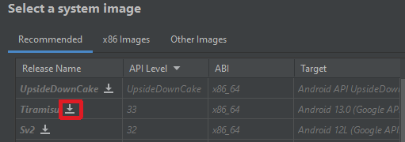
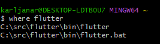
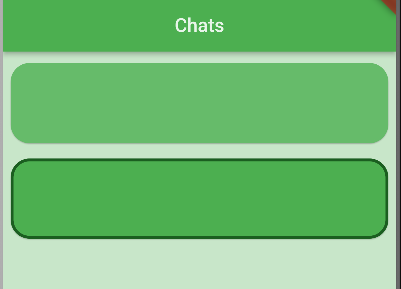
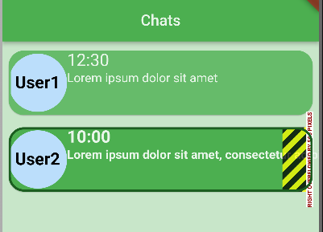
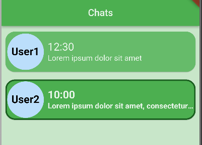
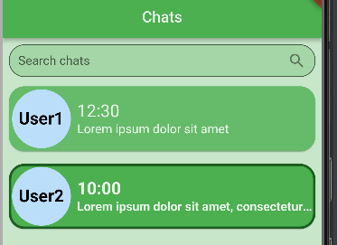
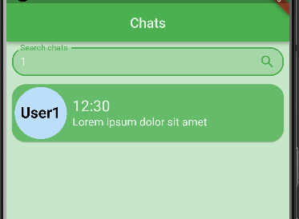
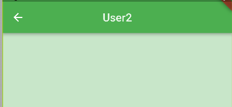


#
#
#
#
#
Flutter õppematerjal
#
											
#
									Autor: Karl Janar Kinkar
#
# 
# Sisukord

[**Sisukord	2**](#_w0yutbxmblx9)**

[**Sissejuhatus	3**](#_wm491qmf9h7w)

[**1. Android Studio paigaldamine	5**](#_x1pp4g8cixq5)

[1.1. Linux	5](#_fz068wg1gspb)

[1.2. Windows	6](#_gxe26esmgao3)

[1.3. macOS	7](#_x3hxxyz0stl7)

[1.4. Android Studio seadistamine	8](#_t4fds3qm0rro)

[**2. Flutteri paigaldamine	13**](#_sxjm4ny0ci3h)

[2.1. Linux ja macOS	13](#_q3f13p2yd74t)

[2.2. Windows	14](#_k5om72yok3v)

[2.3. Flutteri seadistamine käsureal	17](#_w3ox7acchms1)

[**3. Projekti loomine ja näitekoodiga tutvumine	19**](#_jy0z963z5tha)

[3.1. Projekti loomine	19](#_w711nhrwiuin)

[3.2. Näitekoodiga tutvumine	21](#_c6f6agmyp9x9)

[**4. Rakenduse loomine	25**](#_ldbxuixg08rv)

[4.1. Kahe ekraani loomine ning nende vahel navigeerimine	25](#_zfleunmowoz9)

[4.2. Sõnumite Kuvamine	31](#_c7w8c4fg80u)

[4.3. Sõnumi otsimise vidin	41](#_9ctey6e8b2to)

[4.4. Vestluse ekraan	46](#_n2przgnt5ol4)

[4.5. Sõnumite saatmine vestlusesse	56](#_43vli25cqyjt)

[**Edasiseks lugemiseks	63**](#_7eht295b57i8)
#

#
# 
# Sissejuhatus

Antud õppematerjal on loodud Veebiraamistikud ainekursuse jaoks, et teha tutvust Flutter raamistikuga. Õppematerjal on suunatud mobiilseadmes arendusele, sest autori hinnangul on mugavam visuaalselt loodavat rakendust kontrollida kui tegu on väiksema ekraaniga, et ei peaks tihti aknaid vahetama, et näha, kas kood toimib. Flutteri puhul on tegu platvormist sõltumatu raamistikuga, mis lubab seda koodi ka mujal jooksutada ning loodud koodis on arvestatud mõningate erisustega, mis tekivad veebirakendustel. Õppematerjal on jagatud neljaks peatükiks, kus kõigepealt paigaldame Android Studio integreeritud arenduskeskkonna, lisades vajalikud sõltuvused, pistikprogrammid ning paigaldame ka emulaatori. Peale seda paigaldame arvutisse Flutteri tarkvaraarenduskomplekti. Enne kui ise hakkame uut koodi kirjutama, vaatame üle Flutteri näitekoodi, et saaks eelduse, mida oodata sellest raamistikust. Viimases peatükis loome väikese sõnumite saatmise rakenduse, kus saab saata nii tekstsõnumeid kui ka pilte.

Õppematerjal eeldab Google Chrome veebibrauseri, macOSi puhul Xcode integreeritud arenduskeskkonna omamist ning Windowsi puhul ka Visual Studio. Veebibrauseri olemasolu lubab koodi jooksutada veebis ning macOSi Xcode ning Windowsi Visual Studio on vajalikud kui on plaanis rakendust omarakendusena (native app) jooksutada.

Koodinäiteid kopeerides on mõistlik peale kleepimist kasutada Android Studio sisseehitatud funktsionaalsust “**Reformat Code**”. Windows operatsioonisüsteemildel ning Debian Linuxil põhinevatel distributsioonidel on kiirklahviks “**Ctrl** + **Alt** + **L**”, macOS operatsioonisüsteemidel “**Option** + **Command** + **L**”. Tuleb tähele panna, et ainult koodinäidete kopeerimisest kasu ei ole, sest koodinäited ei anna 100% ülevaadet tervest failist, vajalik on jälgida selgitavat teksti.

Koodinäited, kus on kasutusel roheline ja/või punane taust, märgivad faili, kus meil on juba varasem kood olemas. Roheline taust näitab lisatud koodi ning punane taust eemaldatud koodi. Kolm punkti koodinäidetes, tähistatud **…**, tähendab, et ülemise rea ning alumise rea vahel on rohkem kui üks rida koodi, mida näites näha pole.

Õppematerjalis loodud rakenduse kood on leitav aadressilt <https://github.com/karljanar/flutter>. Leitud puudused, vead või soovitused saab märkida GitHubi andmehoidlas *Issues* lehel <https://github.com/karljanar/flutter/issues>. 
# 
# 1. Android Studio paigaldamine

Enne Flutteri tarkvaraarenduskomplekti paigaldust on vajalik installeerida Android Studio. See on vajalik, et Flutter** saaks kasutada Android platvormi sõltuvusi. Kuigi Flutteriga on võimalik arendada ka muudes arenduskeskkondades, siis antud õppematerjalis kasutame Android Studiot. Järgnevates alapeatükkides paigaldame Android Studio Windows ja macOS operatsioonisüsteemidel ning Debian Linuxi ning sellel põhinevaltel distributsioonidel ning viimases alapeatükis konfigureerime vajalikud seaded. Eira alapeatükke, mis ei käsitle teie arvuti operatsioonisüsteemi.
## 1.1. Linux

Enne Android Studio paigaldamist on tarvilik installeerida mõned 32-bitised teegid ja Linuxi tööriistaahel käsurealt (Koodinäide 1).

|$ sudo apt install clang cmake ninja-build pkg-config libgtk-3-dev liblzma-dev libc6:i386 libncurses5:i386 libstdc++6:i386 lib32z1 libbz2-1.0:i386|
| :- |

**Koodinäide 1. Linuxi tööristaahela ning 32-bitiste teekide installeerimine**

Nüüd tuleb <https://developer.android.com/studio> leheküljelt alla laadida Android Studio ning käsureal minna Downloads kataloogi ja pakkida lahti Android Studio arhiiv **/usr/local/** kataloogi (Koodinäide 2) muutes **<ver>** välja allalaetud versiooniga, mis on kirjas faili nimes. Lõpptulemusena peaks käsk olema sarnane (Joonis 1).

|$ cd ~/Downloads/ $ sudo tar -xvf android-studio-<ver>-linux.tar.gz -C /usr/local/|
| :- |

**Koodinäide 2. Downloads kataloogi minek ja Android Studio lahtipakkimine**

**Joonis 1. Android Studio lahtipakkimise käsu näide**

Järgmiseks on vaja seadistada virtuaalmasina kiirendus. Kõigepealt tuleb kontrollida, kas arvuti võimaldab seda üldse teha, kui ei võimalda, siis enamus uutest emulaatori versioonidest ei tööta. See ei tähenda, et arendada ei saa vaid, et on vaja programmi jooksutamiseks kasutada muid lahendusi kui emulaatori. Et leida kas virtualiseerimine on arvutis toetatud, tuleb alla laadida **cpu-checker** pakett, ja kasutada selle käsku **kvm-ok** (Koodinäide 3). Kui arvuti võimaldab virtualiseerimist peaks käsurea väljund seda näitama, andes väljundiks “**KVM acceleration can be used**” ning on võimalik installeerida **KVM** (Joonis 2 jaKoodinäide 4).

|$ sudo apt install cpu-checker $ kvm-ok|
| :- |

**Koodinäide 3. Cpu-checker paketti installimine ja kvm-ok käsk**

**Joonis 2. Kvm-ok käsu näide**

|$ sudo apt install qemu-kvm libvirt-daemon-system libvirt-clients bridge-utils|
| :- |

**Koodinäide 4. KVM installeerimine**

Android Studio** käivitamiseks tuleb käsureaga minna kataloogi, kuhu see sai lahti pakitud ja sealt **bin** kataloogi, kust saab käivitada **studio.sh** ja läbida kõik installeri sammud (Koodinäide 5).

|$ cd /usr/local/android-studio/bin/ $ ./studio.sh|
| :- |

**Koodinäide 5. Android Studio käivitamine käsurealt**

## 1.2. Windows
Android Studio paigaldamiseks tuleb <https://developer.android.com/studio> leheküljelt Android Studio installer alla laadida. Kui installer saab alla laetud tuleb see avada ning läbida kõik sammud ilma seadeid muutmata.

Kui installer on oma töö lõpetanud saab avada Android Studio ning läbida installer vajutades **Next** nuppu kuni aknas tuleb ette **SDK Components Setup** tiitel. Siin on vajalik seadistada Androidi tarkvaraarenduse komplekti installeerimise asukoht, installeri poolt ette antud asukoht ei pruugi alati parim olla ning tekitab probleeme kui kasutajanimi on tühikuga. Selleks muudame tarkvaraarenduse komplekti istalleerimise asukohta, luues **C:** kettale uue kataloogi **src** ning sinna lisame kataloogi **AndroidStudio** ning valime selle. Nüüd peab vajutama nuppu **Ok** peale mida võib vajutada **Next** ning läbida kõik ülejäänud sammud ilma seadeid muutmata.

Virtuaalmasina kiirenduse seadistamine sõltub Windowsi operatsioonisüsteemis arvuti protsessori tootjast. Vajaliku tuuma laiendi valime viimases alapeatükis, kus installeerime ka **Android SDK Command-Line Tools** tarkvaraarenduse komplekti. Probleemide esinemise korral on soovitatav vaadata põhjalikumat dokumentatsiooni virtuaalmasina kiirenduse seadistamise kohta Windows operatsioonisüsteemil aadressilt 

<https://developer.android.com/studio/run/emulator-acceleration#vm-windows>.

## 1.3. macOS

Android Studio paigaldamiseks tuleb <https://developer.android.com/studio> leheküljelt see alla laadida kontrollides, et laete alla oma arvuti protsessorile vastava versiooni. Kui fail saab alla laetud, tuleb see avada ning lohistada Android Studio kataloogi **Applications** (Joonis 3).

**Joonis 3. Android Studio paigaldamine macOS operatsioonisüsteemile**

Vajalik on ka seadistada virtuaalmasina kiirendus. Alates macOS X versioonist 10.10 kasutab Android Studio sisse ehitatud **Hypervisor** raamstruktuuri kuid kui see ei suuda algväärtustada on vajalik ka **Intel HAXM** tuuma laiend paigaldada. Selle paigaldusega tegeleme järgmise peatüki alapeatükis, kus lisaks sellele lisame ka **Android SDK Command-Line Tools** tarkvaraarenduse komplekti. Ava Android Studio ja läbi kõik installeri sammud.

## 1.4. Android Studio seadistamine

Kui installer on oma töö ära teinud, avaneb uus aken. Järgmiseks on vaja installida Flutteri pistikprogramm, selleks tuleb valida vasakult menüüst **Plugins**, sealt valida **Flutter** ja vajutada **Install** (Joonis 4) peale mida teha restarti Android Studiole.

**Joonis 4. Android Studio Plugins Aken**

Kui Android Studio on taas avanenud, tuleb vasakult menüüst valida **Projects**. Akna keskel on nüüd kolm nuppu reas ning nende all sinise kirjaga rippmenüü **More Actions**. Vajutades antud rippmenüü peale tuleb valida **SDK Manager** (Joonis 5). 

**Joonis 5. Android Studio Projects aken**

Ilmunud aknas tuleb keskmisest menüüst valida **SDK Tools** ning ilmunud nimekirjas märgistada **Android SDK Command-Line Tools (latest)** märkeruut. macOSi ja Intel protsessoriga Windowsi puhul tuleb märgistada ka **Intel x86 Emulator Accelerator (HAXM installer)** märkeruut joonisel punkt **3.2**. AMD protsessoriga Windowsi jaoks peab valima **Android Emulator Hypervision Driver (installer)** joonisel punkt **3.1**. Kui kõik vajalikud tarkvaraarenduse komplektid on valitud võib vajutada **Apply** (Joonis 6). Kui Android Studio lõpetab installimise võib selle akna sulgeda.

**Joonis 6. Android Studio SDK Manager aken**

Aeg on üles seada Android emulaator. Selleks tuleb Android Studio vasakult menüüst valida **Projects**. Akna keskel on kolm nuppu reas ning nende all sinise kirjaga rippmenüü **More Actions**. Vajutades antud rippmenüü peale tuleb valida **Virtual Device Manager** (Joonis 7). 

**Joonis 7. Android Studio Projects aken**

**Device Manager** aknast tuleb valida **Create device**. Nüüd tuleb valida sobilik telefon, mida emuleerida. Antud õppematerjalis kasutame **Pixel 6 Pro**. Vajutades **Next** tuleb valida sobilik versioon, õppematerjalis kasutame **API Level** veerust versiooni **33**. **Release Name** veerus tuleb sobiva versiooni juures vajutada alla laadimise ikooni ning see paigaldada (Joonis 8). Kui sobilik versioon saab installitud, võib jätkata seadistamist vajutades **Next** nuppu. Nüüd saab üle kontrollida konfiguratsiooni ning seadistada graafika renderdus. Graafika renderdus tuleb muuta **Hardware - GLES 2.0** peale ja vajutada **Finish** (Joonis 9). Sellega saab Android Studio ülesseatud ning saame hakata paigaldama Flutteri tarkvaraarenduskomplekti.

**Joonis 8. Android süsteemi versiooni paigaldamine**

**Joonis 9. Android Studio Virtual Device Configuration**

# 
# 2. Flutteri paigaldamine

Flutteriga arendamiseks on vajalik paigaldada Flutteri tarkvaraarenduskomplekt ning erinevatel platvormidel see seadistada. Järgmistes alapeatükkides seadistatakse Flutter üles Windows, macOS operatsioonisüsteemidel ja Debian Linuxi ning sellel põhinevaltel distributsioonidel. Eira alapeatükke, mis ei käsitle teie arvuti operatsioonisüsteemi.

Kui teil puudub Git versioonihaldustarkvara, siis see on võimalik paigaldada aadressilt <https://git-scm.com/downloads>.
## 2.1. Linux ja macOS

Linuxi ja macOSi puhul on see alapeatükk peaaegu täiesti kattuv, macOSi vajab ainult ühte lisa rakendust, seda ka juhul kui Android Studio asemel on plaanis kasutada Xcode integreeritud arenduskeskkonda. Flutteri tarkvaraarenduskomplekti paigaldamiseks on vajalik avada käsurida ning luua uus kataloog kuhu tarkvaraarenduskomplekt paigaldada. Peale mida tuleb minna loodud kataloogi ning kasutades Git versioonihaldustarkvara, tuleb kloonida Flutteri tarkvaraarenduskomplekti stabiilne haru (Koodinäide 6).

|$ mkdir development && cd development/ && git clone https:*//github.com/flutter/flutter.git -b stable*|
| :- |

**Koodinäide 6. Käsureal kataloogi loomine ning flutteri kloonimine**

Kui Git on kloonimise lõpetanud ja käsureale saab uuesti kirjutada, peab lisama flutteri programmi, mis asub kloonitud kataloogis, **PATH** keskkonnamuutujasse, et seda saaks hiljem teistest programmidest käivitada. PATHi lisamiseks on vajalik kõigepealt leida tee juurkataloogist oma praegusesse kataloogi, mida saab teha käsuga **pwd** (Koodinäide 7 ja Joonis 10).

|$ pwd|
| :- |

**Koodinäide 7. Käsk nägemaks teed juurkataloogist praegusesse kataloogi**

Käsurea väljund peaks sarnanema nüüd olema sarnane (Joonis 10).

**Joonis 10. Pwd käsu näide**

Nüüd tuleb (Koodinäide 7) väljund kopeerida ja käsurealt avada **.bashrc** fail kasutades tekstiredaktorit, näiteks nano (Koodinäide 8).

|$ nano ~/.bashrc|
| :- |

**Koodinäide 8. Tekstiredaktoriga .bashrc avamine**

Faili tuleb lisada üks uus rida, kus määrame ära tee flutteri programmini (Koodinäide 9), **<pwd>** vahetada välja (Koodinäide 7) kopeeritud väljundiga. Lõpptulemusena võiks loodud rida välja näha sarnane (Joonis 11).

|**export** PATH="$PATH:<pwd>/flutter/bin"|
| :- |

**Koodinäide 9. Flutteri lisaminine PATHi**

**Joonis 11. Flutteri lisaminine PATHi**

Nüüd tuleb fail ära salvestada ning kinni panna ja käsureal värskendada kesta **.bashrc** loodud muudatusega. Peale mida saab kontrollida, kas käsurida tuvastab flutteri ära, näidates selle asukohta (Koodinäide 10 ja Joonis 12). Kui käsurida flutterit ei tuvasta, siis tuleb kõik sammud üle kontrollida kui ka sellest kasu pole võib proovida arvuti taaskäivitamist.

|$ source ~/.bashrc $ which flutter|
| :- |

**Koodinäide 10. Kesta värskendamine .bashrc muudatustega ning flutteri tuvastamine**

**Joonis 12. Käsurea which flutter käsu näide**

## 2.2. Windows

Flutteri tarkvaraarenduskomplekti paigaldamiseks on vajalik avada käsurida, milles töötab **git** käsk, soovitatav on kasutada Git Bash käsurida ning minna sealt kataloogi kuhu tarkvaraarenduskomplekt paigaldada, meie lisame selle varem loodud **src** kataloogi. Kasutades Git versioonihaldustarkvara, tuleb kloonida Flutteri tarkvaraarenduskomplekti stabiilne haru (Koodinäide 11).

|$ cd C:/src/ && git clone https:*//github.com/flutter/flutter.git -b stable*|
| :- |

**Koodinäide 11. Uue kataloogi loomine ning flutter tarkvaraarenduskomplekti allalaadimine**

Nüüd kui Git on kloonimise lõpetanud ja käsureale saab uuesti kirjutada, võib käsurea sulgeda ning edasi peab lisama flutteri programmi, mis asub kloonitud kataloogis, **PATH** keskkonnamuutujasse, et seda saaks hiljem teistest programmidest käivitada. Windowsi stardimenüüse hakkame kirjutama “**environment**” ning üks hetk peaks arvuti tuvastama, et otsime valikud “**Edit the system environment variables**”, vajutame selle peale ning avaneb uus aken nimega **System Properties** (Joonis 13). Ilmunud aknast tuleb vajutada nupule **Environment Variables…** (Joonis 14). Uues aknas peab valima **User variables for <kasutaja>** alt **Path** ning vajutama nuppu **Edit** (Joonis 15). Ilmunud aknas peab tegema topeltkliki tühja rea peale ning kirjutama tee **C:\src\flutter\bin** peale selle lisame veel Android Studio tarkvaraarenduse komplekti lisades tühjale reale **C:\src\AndroidStudio\platforms** ning järgmisele reale **C:\src\AndroidStudio\platform-tools** (Joonis 16). Kuna me paigaldasime tarkvaraarenduskomplekti teise asukohta kui Android Studio tavaliselt pakub, siis peame ka määra uue asukoha **PATH** keskkonnamuutujas, muidu ei leiaks hiljem flutteri programm seda üles. Peale seda tuleb vajutada kõigis kolmes aknas nuppu **OK**.

**Joonis 13. Stardimenüüs environment otsimine**

**Joonis 14. System Properties akans Environment Variables nupp**

**Joonis 15. Environment Variables akans User variables Path muutmine**

**Joonis 16. Edit environment variable akans uue tee lisamine flutter bin kataloogi**

Käsurida on vaja taaskäivitada ning kontrollida käsuga **where** kas see suudab leida flutteri üles (Koodinäide 12 ja Joonis 17). Kui käsurida flutterit ei tuvasta, siis tuleb kõik sammud üle kontrollida kui ka sellest kasu pole võib proovida arvuti taaskäivitamist.

$ where flutter

**Koodinäide 12. Flutteri tuvastamine käsurealt**

**Joonis 17. Flutteri tuvastamise väljund käsureal**
## 2.3. Flutteri seadistamine käsureal

Käsureal tuleb nüüd aktsepteerida Android tarkvaraarenduskomplekti litsents käsuga **flutter doctor --android-licenses** ning seejärel jooksutada **flutter doctor** käsk, mis kontrollib, et kõik vajalikud asjad oleksid olemas (Koodinäide 13). Väljundiks peab **flutter doctor** andma “**No issues found!**” kui kõik eeldused on täidetud** (Joonis 18). Kui macOSi juures tuli Xcode juures hüüumärk teatega “**CocoaPods not installed.**” ja Xcode on arvutis olemas, siis tuleb installida käsurealt CocoaPods (Käsunäide 14).

|$ flutter doctor --android-licenses $ flutter doctor|
| :- |

**Koodinäide 13. Flutter doctor**

**Joonis 18. Flutter doctor käsu näide** 

$ sudo gem install cocoapods

**Koodinäide 14. CocoaPods paigaldamine käsurealt**

# 
# 3. Projekti loomine ja näitekoodiga tutvumine
## 3.1. Projekti loomine

Flutter projekti loomine on Android Studios on üpriski lihtne. **Android Studio** avaaknast tuleb valida **Projects** ning keskmisest menüüst **New Flutter Project** (Joonis 19).

**Joonis 19. Android Studio New Flutter Project**

Ilmunud **New Project** aknal tuleb kontrollida, kas vasakult menüüst on valitud **Flutter** kui ei ole siis tuleb see sealt valida. Seejärel vajutada **Next** ning valida projekti nimi. Juhul kui **Next** ei saa vajutada ning **Flutter SDK path** on tühi, peab vajutama nuppu **…** ning leidma **flutter** kataloogi ja vajutama **Ok** (Joonis 20). Antud õppematerjali raames tuleb projekti nimeks **demo**, aga selle nimi ei oma tähtsust ning ülejäänud valikud võib jätta vaikimisi olekusse ja vajutada **Finish** (Joonis 21). Vaikimisi olekusse jäänud valikud võimaldavad valida projekti asukohta kettal, kirjeldust, projekti tüüpi, organisatsiooni, Android ja iOS platvormi programmeerimiskeelt ning platvorme, mille peale rakendust luua soovitakse.

**Joonis 20. Flutter SDK path lisamine**

**Joonis 21. Android Studio New Project**

Kui projekt loodud saab, avaneb **Android Studio** projekti põhiaken. Akna vasakus ääres on projekti vaade (Project view), punane kast tähistusega 1, seal on näha kõik projekti kataloogid ja failid. Kõige olulisemad kataloogid on **lib**, kuhu tuleb kirjutada terve projekti kood ning **test** kuhu saab testid kirjutada. Akna üleval paremas ääres asub tööriistariba (toolbar), punane kast tähistusega 2, mis pakub erinevaid valikuid koodi jooksutamiseks (Joonis 22).

**Joonis 22. Android Studio demo projekt**

## 3.2. Näitekoodiga tutvumine

Näitekoodiga tutvumiseks tuleb avada **lib** kataloogis olev **main.dart** fail. See on vaikimisi esimene, mis käivitatakse koodi jooksutamise ajal. Funktsioon **main** kutsub välja funktsiooni **runApp**, mis võtab sisendiks **widget** tüüpi klassi nimega **MyApp**, seab selle rakenduse juureks** ning paigutab selle ekraanile.

Flutteris kutsutakse kõiki kasutajaliidese komponente **widget** ehk vidin nimega. Tegu võib olla lihtsa tekstiga nagu “Tere Maailm!” või hoopis nupuga, mis muudab teksti. Paljud vidinad on juba Flutterisse sisse ehitatud kuid neid on võimalik ka ise luua. Vidinaid on võimalik ka omavahel ühendada ning luua küljendusi, mis on samuti vidinad. Küljenduse mõte on panna paika nähtavate vidinate suurused ning paigutuse ekraanil.

Klass **MyApp** on **StatelessWidget** klassi alamklass, Flutteris võib vidin olla kas olekuta (stateless) või olekuga (stateful). **StatelessWidget** ehk olekuta vidin tähendab, et nii nagu loodud vidin üles ehitatud on, nii on ta ka renderdatud, puudub dünaamiline olek, mis andmete muutumise korral või kasutaja interaktsiooni korral vidinat värskendaks. Seevastu **StatefulWidget** ehk olekuga vidin on dünaamiliselt värskendatav.

Vidina peamine ülesanne on teostada **build** meetodit, mis loob ning tagastab vidinapuu. **MyApp** tagastab **build** meetodis vidina **MaterialApp**, see annab meile mitmeid vajalikke stiile ja struktuure. **MaterialApp** kasutab näitena kolme omadust (property): **title**, ehk tiitel, mida seade saaks näidata, **theme**, kus on võimalik terve projekti värviskeemi paika panna ning **home**, kuhu peab märkima milline vidin on esimene, mida rakendus käivitamisel näitab. Näidises on selleks vidin **MyHomePage** ning me anname sellele kaasa ka parameetri **title**.

Kui **MyApp** olekut ei omanud, siis **MyHomePage** puhul on tegu olekuga vidinaga. Konstrueerija nõuab **title** nimelist muutujat, mida ka **MyApp** andis ning see saab defineeritud **final** võtmesõnana. Nii **const** kui ka **final** tähendab, et muutujat saab ainult ühe korra seada ning seda muuta enam ei saa kuid **final** võimaldab omistada väärtuse konstrueerijast, mida **const** teha ei luba. Lõpuks luuakse **MyHomePage** **State** objekti alamklass **\_MyHomePageState.** Alakriips loodud objekti ees tähendab, et tegu on privaatse objektiga ning seda pole võimalik väljaspoolt seda faili muuta.

Loodud **\_MyHomePageState** sisaldab funktsiooni **\_incrementCounter**, mis kutsub välja **setState** funktsiooni, kus sees suurendatakse muutuja väärtust. Iga kord kui on vaja mingit muutust kuvada, peab **setState** funktsiooni välja kutsuma, see annab flutterile teada, et on toimunud muudatus ning vidina **build** meetod käivitub uuesti. **Scaffold** klass, mida **build** meetod tagastab, omab mitmeid omadusi, mida võib arenduse käigus tarvis minna. Näitena on välja toodud **appBar**, mis loob rakenduseriba (appbar) seadme üles, lisades sinna teksti, mida **MyApp** konstrueerija omastas ja **body**, ehk rakenduse keha, kuhu käivad peamised vidinad, mida rakendus kuvama peaks. Antud juhul on selleks kaks **Column** vidinas, küljenduse vidin, mis paneb oma tütred veergu, olevat **Text** vidinat, mis kuvavad ekraanil teksti, ning need on asetatud ekraani keskele kasutades **Center** vidinat ja **mainAxisAlignment** omadust. Viimasena on toodud välja **floatingActionButton**, see ilmub **body** peale, alla paremasse nurka. Selle peamisteks omadusteks on tütar (child) vidin **Icon**, millega on võimalik kuvada erinevaid ikoone ning **onPressed**, mis kutsub välja **\_incrementCounter** funktsiooni kui nupu peale on vajutatakse.

Rakenduse käivitamiseks on kõigepealt vaja panna tööle Android emulaator. Selleks tuleb tööriistaribalt valida **Device Manager** ning panna tööle varem loodud emulaator (Joonis 23). Windowsi puhul võib küsida, kas seadistada virtuaalmasina kiirendus, sealt peab valima **Ok** ning läbima installeris kõik sammud. Kui emulaator on tööle läinud, ilmub tööriistaribale selle nimi ja vajutades **Run** nupule läheb rakendus tööle (Joonis 24). Töötaval rakendusel on näha, kuidas on kõik vidinad lõpuks küljenduse on moodustanud. Ekraani üleval on rakenduseriba, kus on näha teksti, mida **MyApp** klassis sai **MyHomePage** klassile kaasa antud. Keskel on kaks rida teksti ning all paremas nurgas on nupp, mida vajutades ekraani keskel olev arv suureneb (Joonis 25).

**Joonis 23. Emulaatori käivitamine**

**Joonis 24. Rakenduse käivitamine**

**Joonis 25. Töötav rakendus.**

**Ülesanne**: Lisada nupp, mis vajutuse korral vähendaks ekraani keskel olevat arvu. Vaata kuidas tekstid on ühte veergu pandud. Ikoone nuppude jaoks leiab aadressilt <https://mui.com/material-ui/material-icons/>. 

# 
# 4. Rakenduse loomine

Selle peatüki käigus loome algse vestlusrakenduse, millega on võimalik saata sõnumeid ja pilte. 

## 4.1. Kahe ekraani loomine ning nende vahel navigeerimine

Selle alapeatüki käigus loome kaks uut ekraani, sõnumite ning profiili jaoks ja paneme paika mooduse nende vahel navigeerimiseks. Flutteris kutsutakse ekraani ka **route** nime all. 

Uute ekraanide jaoks loome kaks uut **dart** faili **chats** ja **profile**. Mugav oleks need kohe **main.dart** failiga samase kataloogi panna kuid failide arvu suurenemisega oleks raskem õiget faili kiirelt üles leida. Peamine meetod selle probleemi lahendamiseks on luua eraldi kataloogid ekraanide, vidinate, mudelite ning teenuste jaoks. Seda me ka selle õppematerjali puhul kasutame. Android Studios uue kataloogi loomiseks tuleb **lib** kataloogi peale teha parem klikk, valida **new** seejärel **directory** (Joonis 26). Kataloogi nimeks tuleb panna **screens**, sinna kataloogi tulevad kõik meie rakenduse erinevad ekraanid. Uue dart faili loomiseks tuleb teha parem klikk **screens** kataloogil, valida **new** ning siis valida **Dart File** (Joonis 27). Uue faili nimeks tuleb panna **chats**. Korrata seda protsessi ühe korra veel ning luua ka **profile** nimeline fail.

**Joonis 26. Uue kataloogi loomine**

**Joonis 27. Uue dart faili loomine**

Nüüd lisame mõlemasse loodud faili trafarett (boilerplate) koodi, et neid saaks probleemideta mujal kasutada. Profiili ekraani puhul kasutame olekuta vidinat, sest sellel ekraanil ei ole kavas kuvada muutuvat infot, **screens/profile.dart** failis on vajalik importida **material** pakett ning luua olekuta vidina klass **ProfileScreen**, mis tagastab hetkel **Text** vidina väärtusega **“PROFILE”** (Koodinäide 15). 

|**import** 'package:flutter/material.dart';  **class** **ProfileScreen** **extends** **StatelessWidget** { ` `**const** ProfileScreen({**super**.key});  ` `**@override** ` `Widget build(BuildContext context) { `   `**return** **const** Text("PROFILE"); ` `} }|
| :- |

**Koodinäide 15. Profiili ekraani olekuta vidina trafarett kood.**

Kuigi loome hetkel ainult trafarett koodi, siis sellegipoolest sõnumite ekraani puhul kasutame olekuga vidinat, sest hilisemates peatükkides lisame funktsionaalsuseid, mis nõuavad oleku muutust. Selleks loome olekuga vidina klassi **ChatsScreen** olekuga **ChatsScreenState**, mis tagastab praegu samamoodi **Text** vidina väärtusega **“CHATS”**. Nagu ka profiili ekraani puhul, on vajalik importida **material** pakett (Koodinäide 16). 

|**import** 'package:flutter/material.dart';  **class** **ChatsScreen** **extends** **StatefulWidget** { ` `**const** ChatsScreen({super.key});  ` `**@override** ` `ChatsScreenState createState() => ChatsScreenState(); }  **class** **ChatsScreenState** **extends** **State**<**ChatsScreen**> { ` `**@override** ` `Widget build(BuildContext context) { `   `**return** **const** Text("CHATS"); ` `} }|
| :- |

**Koodinäide 16. Sõnumite ekraani olekuga vidina trafarett kood.**

Et loodud ekraanide vahel saaks navigeerida, vajab **main.dart** fail muudatusi. Loodud näitekoodist võib ära eemaldada kõik kommentaarid, et oleks selgem ülevaade koodist ning eemaldame ka terve koodi **\_MyHomePageState** olekust. Järgmiseks tuleb importida äsja loodud ekraanid (Koodinäide 17).

|**import** 'package:flutter/material.dart';  **import** '../screens/chats.dart'; **import** '../screens/profile.dart';                      **void** main() { `  `runApp(**const** MyApp());|
| :- |

**Koodinäide 17. Ekraanide importimine.**

Järgmiseks kohandame **MyApp** vidina omadusi. Vahetame **theme** omaduses **primarySwatch** väärtuse sinisest roheliseks ning lisame juurde kujundust **AppBar** ja **BottomNavigationBar** vidinate jaoks. Teksti värvi **AppBar** vidinal muudame samuti roheliseks kuid kasutame ka värvi omadust **shade50**, see lubab saada meil rohelise kõige heledama tooni. **BottomNavigationBar** puhul paneme tasutavärvi roheliseks, omaduse **selectedItemColor** roheliseks omadusega **shade50** ja **unselectedItemColor** roheliseks omadusega **shade900**. Väljakutsutud **MyHomePage** vidinast eemaldame **title** parameetri (Koodinäide 18).

|
**return** MaterialApp( `  	`title: 'Flutter Demo', `  	`theme: ThemeData(

`           `primarySwatch: Colors.blue, `      	`primarySwatch: Colors.green, `      	`appBarTheme: AppBarTheme( `        	`titleTextStyle: Theme.of(context)             	.textTheme             	.apply( `              	`bodyColor: Colors.green.shade50, `              	`displayColor: Colors.green.shade50, `            	`)             	.headline6, `      	`), `      	`bottomNavigationBarTheme: BottomNavigationBarThemeData( `        	`backgroundColor: Colors.green, `        	`selectedItemColor: Colors.green.shade50, `        	`unselectedItemColor: Colors.green.shade900,), `      	`)),

`     `home: const MyHomePage(title: 'Flutter Demo Home Page'), `  	`home: **const** MyHomePage(), `	`);
|
| :- |

**Koodinäide 18. MyApp vidina kohandamine.**

**MyHomePage** konstrueerijast tuleb nüüd samuti eemaldada **title** ja selle** muutuja võib kustutada (Koodinäide 19).

|
**class** **MyHomePage** **extends** **StatefulWidget** {

`  `**const** MyHomePage({**super**.key, required **this**.title}); `  `**final** String title; `  `**const** MyHomePage({**super**.key});  `  `**@override** `  `State<MyHomePage> createState() => \_MyHomePageState();
|
| :- |

**Koodinäide 19. MyHomePage vidina puhastamine.**

Varasemalt tühjaks tehtud **MyHomePage** vidina olekusse **\_MyHomePageState** lisame nüüd kaks muutujat, täisarvu tüüpi muutuja **pageIndex**, millele anname algseks väärtuseks nulli ning **final** võtmesõnaga massiivi **pages**, mis sisaldab meie poolt loodud kahte ekraani **ChatsScreen** ja **ProfileScreen**. Meetodiga **build** tagastame **Scaffold** vidina kolme omadusega: **appBar**, **home** ja  **bottomNavigationBar**. Omaduse **appBar** väärtuseks kasutame vidinat **AppBar**, märgime ära, et tekst ilmuks vidina keskele, kasutades **centerTitle** omadust, ja tekstiks on sõltuvalt varem loodud **pageIndexi** väärtusele **“Chats”** või **“Profile”** kasutades ternaarset tingimusliku operaatorit (ternary operator). Omaduse **body** vidinana kasutame loodud **pages** massiivist ekraani, mille indeksiks on **pageIndex** muutuja. Iga kord kui toimub oleku muutus, olenevalt **pageIndex** muutujast kuvatakse meile vastav ekraan. Ekraanide vahel navigeerimiseks on ka muid lahendusi, millest ühega tutvume hilisemas alapeatükis, aga meie väikse rakenduse jaoks sellest piisab. Viimasena seame paika omaduse bottomNavigationBar, andes selle väärtuseks vidina **BottomNavigationBar**. See lubab meil luua alumise navigeerimisriba, kus on valikud erinevate ekraanide vahel. Seame **currentIndex** omaduse vastavusse **pageIndex** muutujaga, et visuaalselt oleks näha, milline aken on hetkel valitud. Järgmisena lülitame välja akustilise ja taktilise tagasiside, aga kui soovite tagasisidet ekraanide vahetamisel võib selle sammu vahele jätta. Et ekraanide muutmine ka toimiks, on vaja lisada **onTap** omadus, mis puute korral kutsub välja **setState** funktsiooni ning muudab **pageIndex** muutuja vastavusse vajutatud **BottomNavigationBarItem** vidina indeksiga. Lõpuks lisame omadusse **items** kaks **BottomNavigationBarItem** vidinat. See vidin kuvab navigeerimisribal interaktiivse ikooni, meil on vaja lisada üks vidin, mis kuvab **chat** ikooni ning teksti **“Chats”** ja teine vidin, mis kuvab **person** ikooni tekstiga **“Profile”** (Koodinäide 20). Kuigi omadus **label** on märgitud valikulisena, siis see peab siiski olema märgitud kui kasutame **BottomNavigationBar** vidinat.

|
**class** **\_MyHomePageState** **extends** **State**<**MyHomePage**> { `  `int pageIndex = 0; `  `**final** pages = [**const** ChatsScreen(), **const** ProfileScreen()];  `  `**@override** `  `Widget build(BuildContext context) { `	`**return** Scaffold( `    	`appBar: AppBar( `        	`centerTitle: **true**, `        	`title: Text(pageIndex == 0 ? "Chats" : "Profile")), `    	`body: pages[pageIndex], `    	`bottomNavigationBar: BottomNavigationBar( `      	`currentIndex: pageIndex, `      	`enableFeedback: **false**, `      	`onTap: (int selection) { `        	`setState(() { `          	`pageIndex = selection; `        	`}); `      	`}, `      	`items: **const** [ `        	`BottomNavigationBarItem(icon: Icon(Icons.chat), label: "Chats"), `        	`BottomNavigationBarItem( `          	`icon: Icon(Icons.person), `          	`label: "Profile", `        	`)],));}

}
|
| :- |

**Koodinäide 20 . MyHomePage oleku seadistamine.**

Käivitades rakenduse, peaks olema nüüd näha rohelist värvi ülemist rakenduseriba tekstiga “**Chats**”, valge taustaga keha tekstiga “**CHATS**” ning rohelist alumist navigeerimisriba kahe ikooniga (Joonis 28). Vajutades ikoonidele peaks ülemise rakenduseriba tekst ja keha tekst muutuma vastavalt klikitud või puudutatud ikoonile.

**Joonis 28. Kahe ekraaniga rakendus.**

**Ülesanne**: Katsetada **screens/profile.dart** failis **Text** vidina paigutamist ekraani alla ja üles.

## 4.2. Sõnumite Kuvamine

Selles alapeatükis täiustame loodud sõnumite ekraani **ChatsScreen** luues uue sõnumite loendi vidina, mis kuvab kõiki sõnumeid erinevatelt kasutajatelt, reaalses vestlusrakendus kuvaks siinkohal viimast sõnumit igalt kontaktilt. Kui me mingit vidina puud tahame ka mujal kasutada kui ainult ühes kohas, siis on mõtekas luua eraldi vidin selle jaoks. Kuigi hetkel pole plaanis loodavat vidinat mujal kasutada, siis õppimise eesmärgiks selle loomine siiski sobib.

Kõigepealt lisame **main.dart** failis **ThemeData** klassi **scaffoldBackgroundColor** omaduse. Omaduse väärtuseks paneme rohelise värvi, tooniga **shade100**, nii on meie rakenduse **Scaffold** vidina taustavärv heleroheline. Lisame ka **textTheme** omaduse, kus seadistame **bodyColor** ja **displayColor** omaduse vastavusse rohelise värvi, tooniga **shade50** (Koodinäide 21).

|`          `unselectedItemColor: Colors.green.shade900, `    	`), `    	`scaffoldBackgroundColor: Colors.green.shade100, `    	`textTheme: Theme.of(context).textTheme.apply( `      	`bodyColor: Colors.green.shade50, `      	`displayColor: Colors.green.shade50, `    	`), `  	`), `  	`home: **const** MyHomePage(), `	`);|
| :- |

**Koodinäide 21. ThemeData täiendamine scaffoldBackgrounColor ja textTheme omadustega**

Sõnumite kuvamiseks on vajalik ka muidugi informatsiooni sõnumi kohta. Plaanis on kuvada kasutajanime, kellaaega, ja sõnumit. Peale selle üritame eristada sõnumeid, mida me oleme avanud ja neid mida me ei ole. Et seda informatsiooni töödelda saaks, tuleb meil luua esmalt mudel. Mudeli loomiseks tuleb luua uus kataloog **lib** kataloogi nii nagu me varem **screens** kataloogi lõime (Joonis 26). Seekord paneme kataloogi nimeks **models** ja loome sinna **dart** faili nimega **chats** (Joonis 27). Loodud faili loome klassi **Chats** ning määrame ära stringtüüpi omadused: **name, message** ja **time**. Lisaks ühe tõeväärtustüüpi omaduse **seenMessage**. Loodud omadused tuleb ka **Chats** konstrueerijasse panna (Koodinäide 22).

|**class** **Chats** { ` `String name; ` `String message; ` `String time; ` `bool seenMessage;  ` `Chats( `     `{required **this**.name, `       `required **this**.message, `       `required **this**.time, `       `required **this**.seenMessage, `     `}); }|
| :- |

**Koodinäide 22. Chats mudel**

Nüüd on meil võimalik importida loodud mudel ning lisada see sõnumite ekraani **ChatsScreenState** olekusse, luues **Chats** tüüpi loendi nimega **\_chatList**. Loendisse lisame kaks **Chats** klassi, ühel paneme **name** väärtuseks **“User1”** ja teisel **“User2”**. Sõnumiks kasutame Lorem Ipsum kohatäidet, esimese klassi puhul kasutame ainult mõnda sõna kuid teise klassi puhul lisame vähemalt seitsme sõna pikkuse kohatäiteteksti, et oleks näha ühte probleemi, mis hiljem esile tuleb. Mõlema klassi puhul võib **time** omaduse väärtus olla sama kuid **seenMessage** paneme esimese klassi puhul tõeseks ning teise klassi puhul vääraks (Koodinäide 23).

|**class** **ChatsScreenState** **extends** **State**<**ChatsScreen**> { ` `**final** List<Chats> \_chatList = [ `   `Chats( `       `name: "User1", `       `message: "Lorem ipsum dolor sit amet", `       `time: "12:30", `       `seenMessage: **true**), `   `Chats( `       `name: "User2", `       `message: `       `"Lorem ipsum dolor sit amet, consectetur adipiscing elit, sed do eiusmod tempor incididunt ut labore et dolore magna aliqua", `       `time: "12:30", `       `seenMessage: **false**), ` `];  ` `**@override** ` `Widget build(BuildContext context) {|
| :- |

 **Koodinäide 23. \_chatList loendi lisamine**

Vidina **build** meetodist eemaldame **Text** vidina ning asendame selle **SingleChildScrollView** vidinaga. See vidin on meile vajalik kui sõnumeid on rohkem kui ekraanil ruumi ja meil on vaja kerida, et näha kõiki sõnumeid. Tütar vidinaks paneme **Column**, et hiljem lisada uus vidin sellele ekraanile lisaks. **Column** tütrena kasutame konstrueerijat **ListView.builder**, see loob keritava massiivi vidinatest. Omaduse **shrinkWrap** väärtuseks paneme **true**. Kui me kasutame **ListView** vidinat, mis on mingi teise vidina tütar vidin, nagu ka meil hetkel on, siis **shrinkWrap** omadus on vajalik, et **ListView** ei oleks sama suur kui selle ema (parent) vidin. Seadistades selle omaduse **true** peale, kasutab **ListView** ainult nii palju ruumi kui ta tegelikult vajab. Järgmiseks seadistame **physics** omaduse kasutama konstantset **ScrollPhysics** vidinat, vajalik et me saaks kerida. Vaja on veel lisada omadus **itemCount**, millele anname väärtuseks meie loodud **\_chatList** loendi pikkuse. Lõpuks lisame omaduse **itemBuilder**, mille väärtuseks loome funktsiooni, mis hetkel tagastab igast **\_chatList** loendist praegusel indeksil oleva **Chats** objekti **message** väärtuse (Koodinäide 24).

|
**@override** `  `Widget build(BuildContext context) {

`      `**return** const Text("CHATS"); `	`**return** SingleChildScrollView( `    	`child: Column( `  	`children: [ `    	`ListView.builder( `        	`shrinkWrap: **true**, `        	`physics: **const** ScrollPhysics(), `        	`itemCount: \_chatList.length, `        	`itemBuilder: (BuildContext context, int index) { `          	     `**return** Text(\_chatList[index].message); `        	`}) `  	`], `	`)); `  `}
|
| :- |

**Koodinäide 24. \_chatList loendist message kuvamine** 

Lõpuks on aeg luua sõnumite loendi vidin, nii nagu ka varasemalt sai kataloogid loodud, on nüüd vaja luua uus kataloog nimega **widgets** ja sinna luua **dart** fail **chatsList** (Joonis 26 ja Joonis 27). Loodud faili täidame trafarett koodiga, sama mida kasutasime sõnumite ekraani koostamisel (Koodinäide 16). Seekord aga paneme klassi nimeks **ChatsList** ja oleku nimeks **ChatsListState**. Sisse on vaja importida **Chats** mudel ning klassis **ChatsList** määrame **Chats** tüüpi muutuja **chats**, mis tuleb lisada ka konstrueerijasse. Konstrueerija eest tuleb eemaldada **const** võtmesõna. 

**ChatListState** olekusse loome **late** võtmesõnaga tõeväärtustüüpi muutuja **seenMessage** ja omistame sellele väärtuse peale **build** meetodi kasutades **ChatsList** vidinas määratud muutujat **chats**. Nüüd tagastame **Container** vidina, mis lubab meil selle tütar vidinaid kujundada. Määrame tütar vidina kõrguseks, omadusega **height**, **100** pikslit, parema ja vasaku külje polstri (padding) **4** pikslit, ülemise polstri **8** pikslit ning alumise külje **0** pikslit, kasutades **padding** omadust. Tütar vidinaks kasutame **Card** nimelist vidinat. **Card** loob ümarate servade ja varjuga paneeli, kuhu sisse on võimalik sisu paigutada. Loodav paneel võiks kuidagi näidata, kas sõnumil on **seenMessage** tõese väärtusega, ehk kas sõnum on loetud või mitte. Selle probleemi lahendame muutes selle paneeli värvi tooni, omadusega **color**, vastavalt **seenMessage** muutuja väärtusele, kasutades **shade400** tooni kui sõnum on loetud ja **shade500** kui sõnum loetud ei ole. Kuigi **Card** vidin loob ümarate servadega paneeli, siis see ümarus ei ole kuigi suur ja võiksime seda ise muuta, lisaks võiks serval olla enda värvitoon, mis määratud samuti **seenMessage** muutujast. Selleks lisame omaduse **shape** ja anname sellele väärtuseks klassi **RoundedRectangleBorder**, see klass loob serva **Card** paneelile ja lubab sellega seonduvaid kujundusi muuta. Serva värvi muutmiseks on vaja lisada omadus **side** ja selle väärtuseks kasutada klassi **BorderSide**. Selles klassis saame muuta serva laiust ja värvi, laiuse muutmiseks tuleb lisada **width** omadus ning selle väärtuseks paneme **3** pikslit. Värviks kasutame rohelist tooniga **shade400** kui **seenMessage** on tõene ning **shade900** kui see muutuja on väär. Servade ümaruse muutmiseks lisame omaduse **borderRadius** klassile **RoundedRectangleBorder** ning selle väärtuseks kasutame konstantset **BorderRadius.all** funktsiooni igal nurgal ning paneme väärtuseks **Radius.circular** funktsiooni, millele anname parameetriks **20** pikslit (Koodinäide 25). 

|**class** **ChatsListState** **extends** **State**<**ChatsList**> { ` `late bool seenMessage; ` `**@override** ` `Widget build(BuildContext context) { `   `seenMessage = widget.chat.seenMessage; `   `**return** Container( `       `padding: **const** EdgeInsets.fromLTRB(4, 8, 4, 0), `       `height: 100, `       `child: Card( `         `color: seenMessage ? Colors.green.shade400 : Colors.green, `         `shape: RoundedRectangleBorder( `             `side: BorderSide( `                 `color: seenMessage `                     `? Colors.green.shade400 `                     `: Colors.green.shade900, `                 `width: 3), `             `borderRadius: **const** BorderRadius.all(Radius.circular(20))),)); ` `}}|
| :- |

**Koodinäide 25. ChatListState olekusse Container ja Card vidina lisamine**

Tagasi sõnumite ekraanile **screens/chats.dart** minnes, tuleb importida just loodud vidin ning muudame **ListView.builder** konstrueerijas **itemBuilder** omaduses ära tagastuse **Text** vidinalt, meie poolt loodud vidinale, andes kaasa terve **Chats** objekti praegusel indeksil (Koodinäide 26). Koodi jooksutades on nüüd sõnumite ekraanil näha kahte tühja paneeli, nendest esimene on heledam ning serva pole näha, teisel on aga tume serv ja tumedam paneel kui esimesel (Joonis 29). 

|
`     `itemCount: \_chatList.length, `     `itemBuilder: (BuildContext context, int index) {

`       `**return** Text(\_chatList[index].message); `       `**return** ChatsList(chat: \_chatList[index]); `     `}) ],
|
| :- |

**Koodinäide 26. Loodud ChatsList vidina kasutusele võtmine**

**Joonis 29. Sõnumite ekraanil paneelid**

Sõnumi andmete kuvamiseks on vaja **ChatListState** olekus **Card** vindale määrata tütar vidin **Row**. Varasemalt oleme küljendus vidinate puhul kasutanud **Column** vidinat, aga kui me tahame, et samal real kuvataks erinevaid andmeid, siis tuleb võtta kasutusele **Row**. Peale andmetele, mida me **\_chatList** loendist saame, võiksime näidata ka sõnumi saatja avatari. Pilte me hetkel kasutama selleks ei hakka, aga kuvame avatari kui värvitud ringi, kus sees on saatja nimi. Selleks lisame esimeseks tütarvidinaks vidina **CircleAvatar**, selle vidinaga ongi võimalik kuvada nii ringikujulist pilti või värvi. Lisaks saab sellele anda tütar vidinaid nagu näiteks **Text**, millega saame sõnumi saatja nime kuvada. Lisame **CircleAvatar** vidinale tausta värviks sinise tooniga **shade100**, selleks tuleb kasutada omadust **backgroundColor**, võimalik on värvi muuta ka omadusega **foregroundImage** kuid siis pole teksti näha. Järgmiseks märgime omaduse **maxRadius** väärtuseks **38** pikslit, et avatar liiga suur ei tuleks. Lisame ka tütar vidina **Text** kuhu tekstiks anname kasutaja nime, lisaks kasutame ka **style** omadust, väärtusega **TextStyle**, et muuta teksti värv mustaks, tekst rasvaseks omadusega **fontWeight** ja fondi suuruseks **22** pikslit** kasutades omadust **fontSize** (Koodinäide 27).

|
`       `borderRadius: **const** BorderRadius.all(Radius.circular(20))),));           

`   `child: Row( `      `children: [ `         `CircleAvatar( `            `backgroundColor: Colors.blue.shade100, `               `maxRadius: 38, `               `child: Text( `                  `widget.chat.name, `                  `style: **const** TextStyle( `                     `color: Colors.black, `                     `fontWeight: FontWeight.bold, `                     `fontSize: 22), `    `),),],),)); ` `}}
|
| :- |

**Koodinäide 27. Row ja CircleAvatar vidina lisamine**

Viimase asjana lisame vidinasse loogika sõnumi kellaaja ja sisu kuvamiseks. Peale **CircleAvatar** vidinat lisame **Column** vidina, kus seame omaduse **crossAxisAlignment** väärtuseks **CrossAxisAlignment.start**, et tekst algaks vasakult ja omaduse **mainAxisAlignment** väärtuseks **MainAxisAlignMent.center**, et tekst oleks paneeli suhtes vertikaalselt keskel. **Column** vidina tütar vidinateks tuleb kaks **Text** vidinat. Esimesse vidinasse paneme sõnumi kellaaja ning lisame ka **style** omaduse, kus määrame fondi suuruseks **22** pikslit ja **fontWeight** omaduse väärtuseks kasutame tavalist teksti kui **seenMessage** muutuja väärtus on tõene ja rasvast teksti kui muutuja väärtus on väär. Teise **Text** vidinasse paneme sõnumi sisu ning **style** omaduse seame samamoodi nagu eelmisel vidinal, muutes ainult fondi suuruse **16** piksli peale (Koodinäide 28).

|
`     `fontSize: 22), `        `),),],),));

`     `fontSize: 22),),), `     `Column(

`       `crossAxisAlignment: CrossAxisAlignment.start,

`       `mainAxisAlignment: MainAxisAlignment.center, `       `children: [ `         `Text(widget.chat.time, `           `style: TextStyle( `            `fontWeight: `              `seenMessage ? FontWeight.normal : FontWeight.bold, `            `fontSize: 22)), `         `Text(widget.chat.message, `           `style: TextStyle( `            `fontWeight: `                        `seenMessage ? FontWeight.normal : FontWeight.bold, `           `fontSize: 16)), `  `],)],),)); }}
|
| :- |

**Koodinäide 28. Sõnumite aja ja sisu näitamine**

Emulaatoris programmi jooksutades on nüüd näha avatari koos nimega ning sõnumi kella aega ja sisu. Neid on küll näha, aga samas on nähtaval ka mitmed probleemid (Joonis 30). Esiteks avatar ei mahu paneeli peale ilusti ning vasakult on see lühemaks tehtud. Lihtsamaid mooduseid selle probleemi parandamiseks on lisada konstante vidin **SizedBox** enne **CircleAvatar** vidinat ning panna selle omaduse **width** väärtuseks **4** pikslit. Üks probleemidest, mis veel silma jääb on avatari ja tekstide vahe on liiga väike, seda saab samamoodi parandada **SizedBox** vidinaga, seekord pannes **width** omaduse **8** piksli peale. Kõige rohkem jääb muidugi silma musta ja kollaste triipudega veateade, mis ütleb, et vidinal on ületäide (overflow) mitmesaja piksliga. Viga seisneb selles, et meil on suur jada teksti pandud ühte ritta, kuhu see ära ei mahu. Vea parandamiseks tuleb meil **Column** vidin, mähkida **Expanded** vidinaga. See vidin lubab oma tütar vidinatel võtta kasutusele kõik vaba pinna. Veel on vaja lisada **Text** vidinasse, mis näitab sõnumi sisu, omadus **overflow** ja selle väärtuseks tuleb panna **TextOverflow.ellipsis**. Kohast, kus teksts hakkas varem üle serva välja jooksma, on nüüd näha kolme punkti (Joonis 31 ja Koodinäide 29).

**Joonis 30. Kujundus probleemidega ChatsList vidin**

|
child: Row( `         `children: [ `           `**const** SizedBox( `             `width: 4, `           `), `           `CircleAvatar( `             `backgroundColor: Colors.blue.shade100, `             `maxRadius: 38, `             `child: Text( `               `widget.chat.name, `               `style: **const** TextStyle( `                   `color: Colors.black, `                   `fontWeight: FontWeight.bold, `                   `fontSize: 22),),), `           `**const** SizedBox( `             `width: 8, `           `), `           `Expanded( `             `child: Column( `               `crossAxisAlignment: CrossAxisAlignment.start, `               `mainAxisAlignment: MainAxisAlignment.center, `               `children: [ `                 `Text(widget.chat.time, `                     `style: TextStyle( `                         `fontWeight: seenMessage `                             `? FontWeight.normal `                             `: FontWeight.bold, `                         `fontSize: 22)), `                 `Text(widget.chat.message, `                     `overflow: TextOverflow.ellipsis, `                     `style: TextStyle(

…

)

],
|
| :- |

**Koodinäide 29. ChatsList kujundus probleemide lahendamine**

**Joonis 31. ChatsList vidinas korrastatud kujundus**

**Ülesanne**: Lisa **Chats** mudelisse värvi omadus, mida **CircleAvatar** kontrollib ja kasutab seda **backgroundColor** omaduses.

**Ülesanne**: Loo profiili ekraanile paneel, kus kuvatakse kasutaja avatari, ta nime ja 

sünnikuupäeva. Katseta erinevaid paneeli kujundusi. Kasutaja andmed võivad olla väljamõeldud.

## 4.3. Sõnumi otsimise vidin

Sõnumite ekraanil me näeme viimaseid sõnumeid, mis meile saadetud on kuid juhul kui meil on sõnumeid palju ja me tahame kiirelt leida kellegi kindla sõnumi peaksime hetkel kerima ja eristama kõikide sõnumite seast just seda, mida tahame. Selle alapeatüki käigus loome otsinguriba (searchbar), mis aitab meil leida õige kasutajanimega sõnumi.

Loome **widgets** kataloogi uue **dart** faili nimega **searchBar** ning avame selle (Joonis 27). Otsinguriba jaoks meil olekut vaja ei ole ning seetõttu võime luua vidina **StatelessWidget** alamklassina. Kopeerime trafarett koodi profiili ekraani koodi näitelt muutes klassi nime **SearchBar**’i peale, samamoodi on vaja muuta nimi ka konstrueerijal (Koodinäide 15). Impordime sisse **Chats** mudeli ning loome **final** võtmesõnaga **Chats** tüüpi loendi **searchableList** ning lisame selle ka konstrueerijasse. Vidina **build** meetodis tagastame **Container** vidina, mille **height** on **50** pikslit, parema, vasaku ja ülemise külje polster on **8** pikslit, alumise külje oma **0** pikslit. Tütar vidinaks kasutame **TextField** vidinat, mis loob teksti sisestusvälja. Kasutades selle omadust **textAlignVertical**, saame teksti joondada vidina üles, mis omakorda tänu **Container** vidinas seatud **height** omadusele joondab teksti hoopis keskele. Kujunduse lisamiseks on omadus **decoration** mille väärtuseks anname **InputDecoration** klassi. Selles klassis seame omaduse **filled** väärtuseks **true**, et tekstiväljal oleks oma taustavärv, **fillColor**, mis määrab taustavärvi, omaduseks seame rohelise värvi tooniga **shade200**. Tekstivälja ümber serva loomiseks tuleb lisada omadus **border** mille väärtuseks kasutame **OutlineInputBorder** klassi, milles seame **borderRadius** omaduse **20** piksli peale. Lisame sildi, et kirjeldada tekstivälja, omadusega **labelText** milleks paneme **“Search chats”**. **TextField** vidinal on veel võimalus kasutada omadust **suffixIcon**, see lisab ikooni tekstivälja lõppu, kasutame seda omadust ja lisame **search** ikooni tekstiväljale (Koodinäide 30). Sõnumite ekraani failis **screens/chats.dart** impordime loodud vidina ning lisame selle **ChatsScreenState** olekusse enne **ListView.builder** konstrueerijat ning anname selle parameetri **searchableList** väärtuseks loendi **\_chatsList** (Koodinäide 31). Nüüd on näha sõnumite ekraanil just loodud vidinat, kuhu sisse on võimalik kirjutada kuigi otsimine veel ei tööta (Joonis 32).

|
**import** 'package:flutter/material.dart'; **import** '../models/chats.dart'; **class** **SearchBar** **extends** **StatelessWidget** { ` `**final** List<Chats> searchableList; ` `**const** SearchBar( `     `{**super**.key,

`      `required **this**.searchableList,});  ` `**@override** ` `Widget build(BuildContext context) {

`   `**return** **const** Text("PROFILE"); `   `**return** Container( `     `height: 50, `     `padding: **const** EdgeInsets.fromLTRB(8, 8, 8, 0), `       `child: TextField( `         `textAlignVertical: TextAlignVertical.top, `         `decoration: InputDecoration( `           `filled: **true**, `           `fillColor: Colors.green.shade200, `           `border: OutlineInputBorder( `             `borderRadius: BorderRadius.circular(20), `           `), `           `labelText: 'Search chats', `           `suffixIcon: **const** Icon(Icons.search), `         `),),); }}
|
| :- |

**Koodinäide 30. SearchBar vidin ilma funktsionaalsuseta**

|child: Column( children: [ ` `SearchBar(searchableList: \_chatList), ` `ListView.builder( `     `shrinkWrap: **true**,|
| :- |

**Koodinäide 31. Sõnumi ekraanil SearchBar vidina kuvamine**

**Joonis 32. Sõnumi ekraanil kuvatav SearchBar vidin**

Otsingu funktsionaalsuse lisamiseks peame **SearchBar** vidinasse **widgets/searchBar.dart** looma uue **void** tüüpi funktsiooni, mille nimeks paneme **\_filterList**, mis nõuab **String** tüüpi parameetrit **value**. Funktsiooni sees loome uue **Chats** tüüpi loendi **resultList** ning anname selle väärtuseks muutuja **searchableList** loendi, kus kasutajanimi sisaldab **value** parameetriga otsitavad nime. Vidina **build** meetodis peame lisama **TextField** vidinale omaduse **onChanged**, mis kutsub tekstiväljal toimunud muudatustega välja funktsiooni **\_filterList** (Koodinäide 32).

|**const** SearchBar({required **this**.searchableList, **super**.key}); **void** \_filterList(String value) { ` `List<Chats> resultList = searchableList      .where((chats) => `         `chats.name.toLowerCase().contains(value.toLowerCase()))      .toList(); } **@override** Widget build(BuildContext context) { ` `**return** Container( `   `height: 50, `   `padding: **const** EdgeInsets.fromLTRB(8, 8, 8, 0), `   `child: TextField( `     `onChanged: (value) => \_filterList(value), `     `textAlignVertical: TextAlignVertical.top,|
| :- |

**Koodinäide 32. Otsingu funktsionaalsuse lisamine**

Kuigi loodud funktsioon peaks otsitavad sõnumid üles leidma, siis on meil sellest vähe kasu, kui meil pole võimalik seda kuidagi kuvada. Kahe erineva vidina vahel suhtlemiseks peame looma **callback** ehk tagasikutse funktsiooni. Kõigepealt lisame **SearchBar** vidinale **final** võtmesõnaga **Chats** tüüpi loendiga funktsiooni **callback** ning lisame selle ka konstrueerijasse. Funktsiooni **\_filterList** lõpus kutsume välja loodud **callback** funktsiooni andes **resultList** loendi sellele kaasa (Koodinäide 33).

|**final** List<Chats> searchableList; **final** Function(List<Chats>) callback;  **const** SearchBar({**super**.key, ` `required **this**.searchableList, ` `required **this**.callback, });  **void** \_filterList(String value) { ` `List<Chats> resultList = searchableList      .where((chats) => `         `chats.name.toLowerCase().contains(value.toLowerCase()))      .toList(); ` `callback(resultList); }|
| :- |

**Koodinäide 33. callback funktsiooni kasutamine SearchBar vidinas**

Sõnumite ekraani failis **screens/chats.dart** peame tegema mitu muudatust. Esiteks loome uue tühja **Chats** tüüpi loendi nimega **\_foundChatList**, millele omistame väärtuseks **\_chatList** loendi, tehes seda uues funktsioonis **initState**. See funktsioon läheb tööle kui see vidin esimest korda vidina puuse ühendatakse. Järgmiseks loome **callback** funktsiooni, mille parameetriks on **foundChatUsers** ning see kutsub omakorda välja **setState** funktsiooni pannes **\_foundChatList** väärtuseks **foundChatUsers**. Viimaseks on vaja **ListView.builder** konstrueerijas vaheta välja mõlemad **\_chatList** loendid **\_foundChatList** omaga ning otsingu funktsionaalsus tõõtab (Koodinäide 34 ja Joonis 33).

|
seenMessage: **false**), ];  List<Chats> \_foundChatList = []; **@override** initState() { ` `\_foundChatList = \_chatList; ` `**super**.initState(); }  callback(foundChatUsers) { ` `setState(() { `   `\_foundChatList = foundChatUsers; ` `}); }  **@override** Widget build(BuildContext context) { ` `**return** SingleChildScrollView( `     `child: Column( `   `children: [ `     `SearchBar(searchableList: \_chatList, callback: callback,), `     `ListView.builder( `         `shrinkWrap: **true**, `         `physics: **const** ScrollPhysics(),

`         `itemCount: \_chatList.length, `         `itemCount: \_foundChatList.length, `         `itemBuilder: (BuildContext context, int index) {

`           `**return** ChatsList(chat: \_chatList[index]); `           `**return** ChatsList(chat: \_foundChatList[index]); `         `}) `   `],
|
| :- |

**Koodinäide 34. callback funktsiooni lisamine sõnumite ekraanile**

**Joonis 33. Töötav SearchBar vidin sõnumite ekraanil**

**Ülesanne**: Lisa vidina **SearchBar** vidinasse loogika, et peale nime saaks ka sõnumit selle sisu järgi otsida.

## 4.4. Vestluse ekraan

Praegu me saame kuvada sõnumeid ja neid ka otsida, aga meil puudub võimalus sõnumeid avada ja varasemat vestlust näha. Selles alapeatükis loome uue ekraani kus kuvame kasutajate vahelist vestlust, saades ligi sellele sõnumite ekraanilt, vajutades sõnumi peale. 

Esmalt loome uue ekraani **screens** kataloogi nimega **detailedChat** (Joonis 27). Faili sisu täidame sõnumite ekraani trafarett koodiga, muutes klassi nime ja konstrueerija nime **DetailedChatScreen** peale ning oleku nime **DetailedChatScreenState** peale (Koodinäide 16). **DetailedChatScreen** klassis defineerime **final** võtmesõnaga **String** tüüpi muutuja **name** ning lisame selle konstrueerijasse. **DetailedChatScreenState** olekus tagastame **build** meetodis **Scaffold** vidina ning lisame omaduse **appBar** väärtuseks **AppBar** vidina, kus seame omaduse **centerTitle** väärtuseks **true** ja **title** omaduse väärtuseks **DetailedChatScreen** klassis konstrueerijas saadud **name** muutuja (Koodinäide 35).

|**import** 'package:flutter/material.dart';  **class** **DetailedChatScreen** **extends** **StatefulWidget** { ` `**final** String name; ` `**const** DetailedChatScreen({**super**.key, required **this**.name}); ` `**@override** ` `DetailedChatScreenState createState() => DetailedChatScreenState(); }  **class** **DeatiledChatScreenState** **extends** **State**<**DetailedChatScreen**> { ` `**@override** ` `Widget build(BuildContext context) { `   `**return** Scaffold( `       `appBar: AppBar( `     `centerTitle: **true**, `     `title: Text(widget.name),)); }}|
| :- |

**Koodinäide 35. DetailedChatScreen ekraani algne kood**

Kui me praegu üritame vajutada sõnumi peale, siis midagi ei juhtuks, meil on vaja kuidagi tuvastada, et vajutus on toimunud. Vidin nimega **GestureDetector** on täpselt see, mida meil vaja on. See lubab meil palju erinevaid viipeid tuvastada, millest meil on vaja ainult ühte, milleks on **onTap**. Avades uuesti **widgets/chatsList.dart** faili, mähime **ChatsListState** olekus tagastatava **Container** vidina **GestureDetector** vidinaga. Lisame **GestureDetector** vidinale omaduse **onTap**, mille väärtuseks on funktsioon, kus me kontrollime, kas see sõnum on juba loetud, kui ei ole, siis muudame selle nüüd loetuks. Kui me profiili ja sõnumite vahel navigeerisime kasutades **BottomNavigationBar** vidinat, siis nüüd kasutame **Navigator** vidinat, millega tagastame vestluse ekraani andes kaasa vastava sõnumi saatja nime (Koodinäide 36). Rakenduses vajutades nüüd sõnumi peale avaneb uus ekraan, mille rakenduseriba keskel on sõnumi saatja nimi ning vasakul nurgas on ikoon, mida vajutades saab tagasi sõnumite ekraanile (Joonis 34). Katsetades navigeerimist “**User2**” vestluse ekraanile ning tagasi minnes, on nüüd näha, et see paneel näeb välja samasugune nagu “**User1**” oma, kelle sõnum oli meil loetuna märgitud (Joonis 35).

|
Widget build(BuildContext context) { ` `seenMessage = widget.chat.seenMessage;

` `**return** Container( ` `**return** GestureDetector( `     `onTap: () { `       `Navigator.push(context, MaterialPageRoute(builder: (context) { `         `**return** DetailedChatScreen(name: widget.chat.name); `       `})); `       `setState(() { `         `**if** (seenMessage == **false**) { `           `widget.chat.seenMessage = **true**; `         `} `       `}); `     `}, `     `child: Container( `         `padding: **const** EdgeInsets.fromLTRB(4, 8, 4, 0),
|
| :- |

**Koodinäide 36. Vestluse ekraanile navigeerimine sõnumite ekraanilt**

**Joonis 34. Vestlus ekraani rakenduseriba**

**Joonis 35. User2 sõnum märgitud loetuna**

Vestluse kuvamiseks peame looma ka mudeli, et märkida ära, mis informatsiooni vestlus peaks sisaldama. Loome uue **dart** faili kataloogi **models** nimega **detailedChat** (Joonis 27). Faili algusesse loome kaks loenditüüpi (enum) objekti, esimese nimeks paneme **MessageType** ning anname sellele kaks väärtust: **text** ja **media**. Peale tekstsõnumite on plaanis kuvada ka pilte ning kasutades loodud objekti saame teha nende vahel vahet. Järgmiseks objektiks on **MediaLocation** millel on kaks väärtust: **network** ja **local**, meil on vaja eristada veebis asuvaid pilte nendest, mida me ise saadame, et ei tekiks vigu koodis. Nüüd loome klassi **DetailedChat**, kuhu lisame **String?**, küsimärk andmetüübi lõpus näitab, et see tegu on valikulise muutujaga, tüüpi muutuja **message**, milleks on siis tekstsõnumi sisu. Sõnumi kellaaega tahame ka näidata kuid seekord kasutades **DateTime** tüüpi muutujat **time**. Järgmisena lisame valikulise **String?** tüüpi muutuja **fileName**, mida me kasutame piltide kuvamiseks. Lisame veel valikulise **MediaLocation?** tüüpi muutuja **mediaLocation**, **String** tüüpi muutuja **from** ning **MessageType** tüüpi muutuja **messageType**. Need kõik on vaja ka konstrueerijasse panna (Koodinäide 37).

|**enum** MessageType { text, media } **enum** MediaLocation { network, local }  **class** **DetailedChat**{ ` `String? message; ` `DateTime time; ` `String? fileName; ` `MediaLocation? mediaLocation; ` `String from; ` `MessageType messageType;  ` `DetailedChat( `     `{**this**.message, `     `required **this**.time, `     `required **this**.from, `     `required **this**.messageType, `     `**this**.fileName, `     `**this**.mediaLocation}); }|
| :- |

**Koodinäide 37. DetailedChat mudel**

Vestluse ekraani failis **screens/detailedChat.dart** impordime loodud mudeli ning olekusse **DetailedChatScreenState** lisame **late** võtmesõnaga **DetailedChat** tüüpi tühja loendi nimega **detailedChatList**. Järgmisena lisame **initState** funktsiooni, kus omistame **detailedChatList** loendile väärtuseks esialgu neli vestlust, esimesed kaks on **MessageType.text** tüüpi ja **message** väärtuseks kasutame mõlemal Lorem Ipsum kohatäidet, pikkusel vahet ei ole. Määrame **time** omaduse väärtuseks hetkest kellaaega, kasutades **DateTime** funktsiooni **now**. Esimese vestluse puhul märgime **from** väärtuseks **DetailedChatScreen** klassis konstrueerijas saadud **name** muutuja, teise puhul kasutame väärtust **“You”**. Järgmisel kahel kasutame sama moodust **time** omaduse jaoks, mõlemal on **messageType** omaduse väärtuseks **MessageType.media**, **mediaLocation** on mõlemal **MediaLocation.network** ning mõlemal on **from** väärtusega **“You”**. Esimesel neist määrame **fileName** väärtuseks töötava lingi pildile, teisel, aga katkise lingi, kust pilt on puudu. Vidina **build** meetodis lisame **Scaffold** vidinale **body** omdause ning selle väärtuseks kasutame **ListView.builder** konstrueerijat. Nii nagu me kasutasime ka sõnumite ekraanil **ListView.builder** konstrueerijat, lisame ka siin samad omadused. Esiteks lisame **shrinkWrap** omaduse väärtusega **true**, **physics** omadusele väärtuseks konstante **ScrollPhysics**, **itemCount** väärtuseks **detailedChatList** loendi pikkus ning **itemBuilder**, milleks tuleb funktsioon, mis tagastab vidina **DetailedChatList**, mida me veel loonud pole ning anname kaasa **detailedChatList** loendist **DetailedChat** objekti praegusel indeksil (Koodinäide 38). Uue vidina loome põhjusega, et vähendada koodi kogust praeguses failis.

|
**class** **DetailedChatScreenState** **extends** **State**<**DetailedChatScreen**> { ` `late List<DetailedChat> detailedChatList;  ` `**@override** ` `**void** initState() { `   `detailedChatList = [DetailedChat( `       `message: `       `"Lorem ipsum dolor sit amet, consectetur adipiscing elit, sed do eiusmod tempor incididunt ut labore", `       `time: DateTime.now(), `       `messageType: MessageType.text, `       `from: widget.name), `     `DetailedChat( `         `message: `         `"Lorem ipsum dolor sit", `         `time: DateTime.now(), `         `messageType: MessageType.text, `         `from: 'You'),

DetailedChat( `   `time: DateTime.now(), `   `messageType: MessageType.media, `   `mediaLocation: MediaLocation.network, `   `fileName: "https://picsum.photos/400/500", `   `from: "You"), DetailedChat( `   `time: DateTime.now(), `   `messageType: MessageType.media, `   `mediaLocation: MediaLocation.network, `   `fileName: "https://picsum.p", `   `from: 'You'), `   `]; `   `**super**.initState(); ` `}  ` `**@override** ` `Widget build(BuildContext context) { `   `**return** Scaffold( `     `appBar: AppBar( `       `centerTitle: **true**,

`       `title: Text(widget.name),)); `     `), `     `body: `         `ListView.builder( `             `shrinkWrap: **true**, `             `physics: **const** ScrollPhysics(), `             `itemCount: detailedChatList.length, `             `itemBuilder: (BuildContext context, int index) { `               `**return** DetailedChatList(detailedChat: detailedChatList[index],); `           `}),); }}
|
| :- |

**Koodinäide 38. Vestluse ekraani täiendamine body omaduse ja vestluste andmetega**

Loome **widgets** kataloogi uue **dart** faili nimega **detailedChatList** ning avame selle (Joonis 27). Lisame sõnumite ekraani trafarett koodi, muutes klassi nime **DetailedChatList** peale ning oleku nime **DetailedChatListState** peale (Koodinäide 16). **DetailedChatList** klassis määrame **DetailedChat** tüüpi muutuja **detailedChat**, impordime **DetailedChat** mudeli faili alguses ning lisame **detailedChat** muutuja konstrueerijasse ning eemaldame **const** võtmesõna konstrueerija eest. **DetailedChatListState** olekus loome uue **late** võtmesõnaga tõeväärtustüüpi muutuja **isTextMessage**. Vidina **build** meetodis omistame **isTextMessage** väärtuse kontrollides, kas **MessageType** on praegusel vestlusel **MessageType.text**. Nüüd tagastame **Column** vidina mille esimeseks tütar vidinaks on **CircleAvatar**, mille **maxRadius** on **38** pikslit** ning **backgroundColor** on sinine. Järgmiseks lisame **Card** vidina, mille esimeseks tütar vidinaks on **SizedBox**, kus me määrame **width** omaduseks **12** pikslit kui **isTextMessage** muutuja on tõene, vastasel juhul **0** pikslit. Järgmiseks lisame **Expanded** vidina, et mahutada suurem tekst paneelile, seekord ilma lõppu ära lõikamata. Tütar vidinaks lisame **Column** vidina lisades omaduse **crossAxisAlignment** väärtuseks **start**, vastasel juhul ilmuks väheste sõnadega sõnum paneeli keskele ning pikemate sõnadega sõnumid äärest äärde. Esimeseks tütar vidinaks lisame **SizedBox** mille **height** omaduse paneme **7** piksli peale, et tekst ei algaks liiga ülevalt. Järgmiseks lisame **Center** vidina, kuhu lisame **Text** vidina, kus on kirjas, kes sõnumi siia vestlusesse saatis ja mis hetkel ta seda tegi. Kui tegu on pildiga, kontrollime seda muutujast **isTextMessage** kasutades ternaarset tingimusliku operaatorit, siis sisaldab tekst **“sent”** sõna, teksti puhul **“said”**. Nüüd lisame peale **Center** vidinat veel ühe **SizedBox** vidina, omaduse **height** väärtusega **7** pikslit, et sõnumi päisel ja sisul oleks väike vahe sees. Nüüd kontrollime ternaarset tingimusliku operaatorit kasutades, kas **isTextMessage** on tõene kui jah, siis kasutame **SelectableText** vidinat, et kuvada sõnumi sisu ning kasutame omadust **textScaleFactor**, mille väärtuseks paneme **1.5**, et teksti suurus oleks 1.5 korda suurem päise tekstist. Praegu kasutasime **SelectableText** vidinat kuigi muidu oleme kasutanud ainult **Text** vidinat, **SelectableText** vidin on vajalik kui me tahame, et kõigis seadmetes oleks võimalus teksti kopeerida. Kui aga **isTextMessage** tõene ei ole kasutame vidinat **Container**, lisades omaduse **alignment** ning selle väärtuseks kasutame **topCenter**. Tütar vidina valikul kasutame jälle ternaarset tingimusliku operaatorit, mis kontrollib, kas **mediaLocation** on **network** või **kIsWeb**. Siinkohal on vaja importida pakett **foundation**, et saaksime **kIsWeb** kasutada, **kIsWeb** kontrollib kas meie programm jookseb brauseris või mitte. Kui üks neist väärtustest tõene on, siis kasutame **Image.network** konstrueerijat, andes kaasa pildi lingi **fileName** ning lisame ka omaduse **fit**, mille puhul kasutame väärtuseks **BoxFit.fill**. Kui üksi neist väärtustest tõene ei olnud, kasutame **Image.file** konstrueerijat, lisades sama väärtusega **fit** omaduse ning **File** vidina, kuhu lisame pildi lingi **fileName**. **File** kasutamiseks peab importima **io** paketi (Koodinäide 39).

|**class** **DetailedChatListState extends** **State**<**DetailedChatList**> { ` `late bool isTextMessage;  ` `**@override** ` `Widget build(BuildContext context) { `   `isTextMessage = widget.detailedChat.messageType == MessageType.text; `   `**return** Column( `     `children: [ `       `**const** CircleAvatar( radius: 38, backgroundColor: Colors.blue, ), Card( child: Row( children: [ SizedBox( `           `width: isTextMessage ? 12 : 0,), Expanded( `             `child: Column( `               `crossAxisAlignment: CrossAxisAlignment.start, `               `children: [ `                 `**const** SizedBox(height: 7), `                 `Center( child: Text( `                     `"${widget.detailedChat.from} ${isTextMessage ? "said" : "sent"} on ${widget.detailedChat.time} ",),), `                 `**const** SizedBox(height: 7), `                   `isTextMessage `                       `? SelectableText( `                           `widget.detailedChat.message!, `                           `textScaleFactor: 1.5, `                         `) `                       `: Container( `                           `alignment: Alignment.topCenter, `                               `child: widget.detailedChat.mediaLocation == MediaLocation.network || kIsWeb `                        `? Image.network( `                            `widget.detailedChat.fileName!, `                            `fit: BoxFit.fill `                        `) `                        `: Image.file( `                            `fit: BoxFit.fill, `                            `File(widget.detailedChat.fileName!)), `                        `), `                       `**const** SizedBox(height: 14), ]))],))],);}}|
| :- |

**Koodinäide 39. detailedChatList vidina loomine**

Lisame **main.dart** failis **ThemeData** klassi uue omaduse **textSelectionTheme**, mille väärtuseks on klass **TextSelectionThemeData**, kus määrame ära **selectionColor** ja **selectionHandleColor** omaduse, pannes mõlema väärtuseks rohelise värvi tooniga **shade200** (Koodinäide 40). Vastasel juhul võib osades seadmetes teksti kopeerides värvid kattuda ning poleks näha, mida me tegelikult kopeerime.

|textTheme: Theme.of(context).textTheme.apply( `         `bodyColor: Colors.green.shade50, `         `displayColor: Colors.green.shade50, `       `)), ), ` `textSelectionTheme: TextSelectionThemeData( `     `selectionColor: Colors.green.shade200, `     `selectionHandleColor: Colors.green.shade200), ), home: **const** MyHomePage(),|
| :- |

**Koodinäide 40. main.dart ThemeData täiendamine textSelectionTheme omadusega**

Rakendust jooksutades ja valides sõnumi ühe kasutaja, avaneb meil loodud ekraan ning näeme vestlust. Kuvatud on nii tekst sõnumid kui ka pildid. Sõnumi päises on märgitud kes, millal saatis kuid me võiksime seda kuidagi paremaks muuta ja kuupäeva mitte nii täpselt kuvada. Saaksime luua funktsiooni, mis vormistab kuupäeva nii nagu meile sobiks või saaksime kasutada kellegi teise poolt loodud vormistamise paketti. Teiste inimeste poolt loodud pakette on võimalik leida aadressilt <https://pub.dev/>. Kuupäeva vormistamiseks kasutame paketti nimega **date\_format**, mille lisamiseks peame avama **pubspec.yaml** faili, ning lisama selle paketi **dependencies** alla, märkides ära ka versiooni **2.0.7**. Järgmiseks peab selle paketti alla laadima, seda võib teha **Flutter Commands** rakenduseribalt valides **Pub get**, mis ilmub kui **pubspec.yaml** failis on toimunud muudatusi (Joonis 36).

**Joonis 36. Paketti lisamine ning allalaadimine**

Nüüd saame muuta **widgets/detailedChatList.dart** failis sõnumi päises kuupäeva vormingut. Impordime just paigaldatud paketi ning mähime **Text** vidinas **time** väärtuse **formatDate** funktsiooni sisse, vorminguga **MM**, mis annab sõnaliselt kuu, **d**, mis annab kuupäeva, **HH** mis annab tunnid ning **nn**, mis annab minutid (Koodinäide 41).

|
Center( ` `child: Text(

`   `"${widget.detailedChat.from} ${isTextMessage ? "said" : "sent"} on ${widget.detailedChat.time} ", `   `"${widget.detailedChat.from} ${isTextMessage ? "said" : "sent"} on ${formatDate(widget.detailedChat.time, [ MM, ' ', d, ' at ', HH, ':', ` `nn ])} ", ` `), ), **const** SizedBox(height: 7),
|
| :- |

**Koodinäide 41. Kuupäeva vormingu lisamine**

**Ülesanne**: Hetkel meil on neli vestlust kuigi ühel neist on katkine link ja rakendus näitab ka veateadet selle koha peal. Lisa veakontroll **Image.network** vidinale, mis tagastab punast värvi teksti **“IMAGE NOT FOUND”** kui pilti ei leitud.

**Ülesanne**: Lisa profiili ekraanile vormistatud sünnikuupäev.

## 4.5. Sõnumite saatmine vestlusesse

Selle alapeatüki käigus loome võimaluse saata vestlusesse tekstsõnumeid ja pilte. See nõuab ka esimest korda Androidi ja iOS ehitus konfiguratsiooni muutmist.

Sõnumite saatmiseks peame vestluse ekraanil **screens/detailedChat.dart** lisama natukene loogikat juurde. **DetailedChatScreenState** olekusse lisame **final** võtmesõnaga **ScrollController** tüüpi muutuja nimega **\_scrollController** ja anname selle väärtuseks **ScrollController** klassi. Vidina **build** meetodid mähime **ListView.builder** konstrueerija **ListView** vidinasse ning lisame sellele vidinale omaduse **controller**, mille väärtuseks tuleb meie loodud **\_scrollController**. Peale **ListView.builder** vidinat lisame konstantse **SizedBox** vidina omadusega **height**, mille väärtuseks on **50** pikslit. Järgmisena lisame **final** võtmesõnaga muutuja **textController** ning selle väärtuseks anname **TextEditingController** klassi. Lisame veel ühe **late** võtmesõnaga **String** tüüpi muutuja **messageText**, milles hakkame hoiustama oma saadetavat sõnumit. Nüüd lisame funktsiooni **\_addMessage**, millel on **MessageType** tüüpi parameeter **messageType**. Selle funktsiooniga lisame meie poolt kirjutatud sõnumi **detailedChatList** loendisse. Kasutades **add** funktsiooni lisame uue **DetailedChat** objekti sinna loendisse, pannes **message** väärtuseks **messageText**, **time** praegune aeg, **from** väärtuseks **“You”** ning **messageType** väärtuseks **messageType** muutuja funktsiooni parameetrist. Peale seda kutsume välja **setState** funktsiooni, kus kasutame **\_scrollController**i funktsiooni **animate**, et minna automaatselt sõnumite lõppu, lisades ka animatsiooni pikkuse **100** millisekundit ja **curve** omaduse, mille väärtuseks anname **bounceIn**. Tekstiväli, kuhu saaks uut sõnumit kirjutada, peaks olema kogu aeg nähtaval, selleks kasutame **Scaffoldi** omadust **bottomSheet**, mis lubab luua **body** omadusest allpool, ehk ekraani all oleva vidina, mille väärtuseks kasutame **SizedBox** vidinat. Omadusega **height** seame selle kasti suuruseks **50** pikslit, sellepärast oli peale **ListView.builder** samuti sama vidinat vaja, muidu oleks meie loodab tekstiväli peitnud ära osa sõnumitest. Tütar vidinaks kasutame vidinat **Row**, lisades omadused **mainAxisAlignment** ja **crossAxisAlignment**, andes mõlema väärtuseks **center**. Esimeseks tütar vidinaks on **Expanded** vidina sisse mähitud **TextField**, kuhu märgime **controller** omaduse väärtuseks **textController** ning lisame **onChanged** omaduse, kus omistame muutuse **messageText** muutujasse. Nüüd on meil olemas tekstiväli kuhu saame on soovitud teksti kirjutada kuid selle peab ka kuidagi ära saatma. Selleks lisame Teise tütar vidinana **IconButton** vidina, mille **icon** omaduseks on **send** ikoon ning **onPressed** omaduseks on funktsioon, mis kontrollib kõigepealt, et meie sõnum **messageText** pole tühi, seejärel kutsume välja funktsiooni **\_addMessage**, andes parameetriks kaasa **MessageType.text**, peale mida nullime ära **textController** kasutades **clear** funktsiooni ning **messageText** muutuja (Koodinäide 42).

|**super**.initState(); ` `}  ` `**final** ScrollController \_scrollController = ScrollController(); ` `**final** textController = TextEditingController(); ` `late String messageText;  ` `**void** \_addMessage(MessageType messageType) { `   `detailedChatList.add(DetailedChat( `       `message: messageText, `       `time: DateTime.now(), `       `from: "You", `       `messageType: messageType)); `   `setState(() { `     `\_scrollController.animateTo(\_scrollController.position.maxScrollExtent, `         `duration: **const** Duration(milliseconds: 100), curve: Curves.bounceIn); `   `}); ` `}  ` `**@override** ` `Widget build(BuildContext context) { `   `**return** Scaffold( `       `appBar: AppBar( `         `centerTitle: **true**, `         `title: Text(widget.name), `       `), `       `body: ListView( `         `controller: \_scrollController, `         `children: [ `           `ListView.builder( `               `shrinkWrap: **true**, `               `physics: **const** ScrollPhysics(), `               `itemCount: detailedChatList.length, `               `itemBuilder: (BuildContext context, int index) { `                 `**return** DetailedChatList( `                   `detailedChat: detailedChatList[index], `                 `); `               `}), `           `**const** SizedBox(height: 50), `         `],), `       `bottomSheet: SizedBox( `         `height: 50.0, `         `child: Row( `           `mainAxisAlignment: MainAxisAlignment.center, `           `crossAxisAlignment: CrossAxisAlignment.center, `           `children: [ `             `Expanded( `               `child: TextField( `                 `controller: textController, `                 `onChanged: (value) => messageText = value, `               `), `             `), `             `IconButton( `               `onPressed: () { `                 `**if** (messageText.isNotEmpty) { `                   `\_addMessage(MessageType.text); `                   `messageText = ""; `                   `textController.clear(); `                 `} `               `}, `               `icon: **const** Icon( `                 `Icons.send, `               `),)],),));}}|
| :- |

**Koodinäide 42. Tekstisõnumite saatmise loogika sõnumite ekraanil**

**ThemeData** klassi **main.dart** failis peame lisama **bottomSheetTheme** omaduse, et meie tekstiväli oleks sarnane ülejäänud kujundusega, pannes selle väärtuseks **BottomSheetThemeData** klassi, mille **backgroundColor** omaduse väärtuseks on roheline värv (Koodinäide 43). Töötavas rakenduses saab nüüd minna vestluse ekraanile ning lisada tekstsõnumit (Joonis 37).

|` `unselectedItemColor: Colors.green.shade900, ), bottomSheetTheme: **const** BottomSheetThemeData(backgroundColor: Colors.green), cardColor: Colors.green,|
| :- |

**Koodinäide 43. bottomSheetTheme lisamine ThemeData klassi**

**Joonis 37. Tekstsõnumi saatmine vestlusesse**

Piltide saatmiseks peame juurde lisama ühe uue paketi. Avame pubspec.yaml faili ning lisame dependencies alla **image\_picker** versiooniga **^0.8.6+1** ning laeme selle alla, nii nagu tegime varasemalt **date\_format** paketiga (Joonis 36). Kaamera ja failisüsteemi kasutamiseks peab iOS seadmete konfiguratsiooni lisama seletused, miks on vaja kaamerat ja galeriid kasutada failis **Info.plist**, mis asub kataloogis **/ios/Runner** (Koodinäide 44). Android seadmel peab kaameraga töötamiseks sättima **compileSdkVersion** versioon **33** peale, minimaalselt peaks toimima tegelikult ka alates versioonist **21**. Kuna emulaatorit luues valisime **API Level** versiooni **33**, siis alla selle pole vaja versiooni panna (Joonis 8). Seda saab teha failis **build.gradle**, mis asub kataloogis **/android/app** (Koodinäide 45).

|`   `<key>UIApplicationSupportsIndirectInputEvents</key> `  `<true/> `  `<key>NSPhotoLibraryUsageDescription</key> `  `<string>for images</string> `  `<key>NSCameraUsageDescription</key> `  `<string>for images</string> </dict>|
| :- |

 **Koodinäide 44. Info.plist seadistamine**

|android { `   `compileSdkVersion flutter.compileSdkVersion `   `compileSdkVersion 33 `   `ndkVersion flutter.ndkVersion|
| :- |

**Koodinäide 45. build.gradle seadistamine**

Kui rakendus veel töötab, siis peaks selle praegu korraks seisma panema ning käsureal tuleb jooksutada **flutter clean** käsku. Ilma seda tegemata võib kaamera mitte avada ning pilte ei saaks teha.

Tagasi vestluse ekraani **screens/detailedChat.dart** juurde minnes, impordime sisse **image\_picker** paketi ning lisame **DetailedChatScreenState** olekusse valikulise **XFile** tüüpi muutuja **\_imageFile**, **XFile** andmetüüp on platvormist sõltumatu lihtsustatud **File** andmetüübi abstraheerimine. Järgmiseks loome **final** võtmesõnaga **ImagePicker** tüüpi muutuja **\_picker**, millele anname väärtuseks **ImagePicker** klassi. Nüüd loome asünkroonse funktsiooni **\_onImageButtonPressed**, mis vajab parameetriks **ImageSource** tüüpi muutujat **source**. Funktsiooni sees omistame **\_imageFile** muutujale väärtuseks **\_picker** funktsiooni **pickImage**, mis nõuab parameetriks **source** muutujat. Peale seda kutsume välja **\_addMessage** funktsiooni, andes parameetriks kaasa **MessageType.media**. Kuna meil on vaja eristada, mis sõnumiga tegu on, et kuvada teksti või pilti, siis nüüd mähime **\_addMessage** funktsioonis praeguse **detailedChatList.add** funktsiooni tingimuslause sisse, mis kontrollib, kas tegu on **text** tüüpi **MessageType**ga. Kui ei ole, lisame uue **detailedChatList.add** funktsiooni, kus eemaldame **message** omaduse, lisades **fileName** omaduse, mille väärtuseks tuleb **\_imageFile!.path**. Üks omadus on vaja veel lisada, milleks on **mediaLocation**, selle väärtuseks paneme **MediaLocation.local**, et pilti kuvataks failist, mitte veebist. Jäänud on lisada kaks nuppu tekstiväljale, üks, mis avab galerii ning teine, mis avab kaamera. Enne **Expanded** vidinasse mähitud **TextFieldi** lisame kaks **IconButton** vidinat, andes esimesele **onPressed** omadusele väärtuseks funktsiooni, mis kutsub välja **\_onImageButtonPressed** funktsiooni parameetriga **ImageSource.gallery** ning ikooniks kasutame **gallery** ikooni. Teisel vidinal kutsub samamoodi **onPressed** omadus välja **\_onImageButtonPressed** funktsiooni kuid seekord parameetriga **ImageSource.gallery** ning ikooniks on **camera\_alt** (Koodinäide 46). 

|
` `**final** textController = TextEditingController(); ` `late String messageText; ` `XFile? \_imageFile; ` `**final** ImagePicker \_picker = ImagePicker();  ` `Future<**void**> \_onImageButtonPressed(ImageSource source, {BuildContext? context}) **async** { `   `\_imageFile = **await** \_picker.pickImage(source: source); `   `\_addMessage(MessageType.media); ` `}  ` `**void** \_addMessage(MessageType messageType) { `   `**if** (messageType == MessageType.text){ `     `detailedChatList.add(DetailedChat( `         `message: messageText, `         `time: DateTime.now(), `         `from: "You", `         `messageType: messageType)); `   `} **else** { `     `detailedChatList.add(DetailedChat( `         `time: DateTime.now(), `         `from: "You", `         `fileName: \_imageFile!.path, `         `messageType: messageType, `     `mediaLocation: MediaLocation.local)); `   `}  `   `setState(() { `     `\_scrollController.animateTo(\_scrollController.position.maxScrollExtent, `         `duration: **const** Duration(milliseconds: 100), curve: Curves.bounceIn); `   `}); ` `}  ` `**@override** ` `Widget build(BuildContext context) { `   `**return** Scaffold(

… `         `child: Row( `           `mainAxisAlignment: MainAxisAlignment.center, `           `crossAxisAlignment: CrossAxisAlignment.center, `           `children: [ `             `IconButton( `               `onPressed: () { `                 `\_onImageButtonPressed(ImageSource.gallery, context: context); `               `}, `               `icon: **const** Icon(Icons.photo), `             `), `             `IconButton( `               `onPressed: () { `                 `\_onImageButtonPressed(ImageSource.camera, context: context); `               `}, `               `icon: **const** Icon(Icons.camera\_alt), `             `), `             `Expanded( `               `child: TextField( `                 `controller: textController,
|
| :- |

**Koodinäide 46. Piltsõnumite saatmise loogika lisamine vestluse ekraanil**

Nüüd võib rakenduse uuesti tööle panna ning katsetada piltide saatmist. 

**Ülesanne**: Lisa rakenudseribale nupp, mida vajutades kerib vestluse tagasi algusesse.

**Ülesanne**: Loo uus vidin **widgets** kausta, kus on kõik hetkel **bottomSheet** alla kuuluvad vidinad ja loogika. 
# Edasiseks lugemiseks

Firebase ühendamine Flutter rakendusega: <https://firebase.google.com/docs/flutter/setup?platform=ios>

Adaptiivse ja muganduva veebilahenduse loomine: <https://docs.flutter.dev/ui/layout/adaptive-responsive>

Platvormide vahelised erisused: <https://docs.flutter.dev/resources/platform-adaptations>

